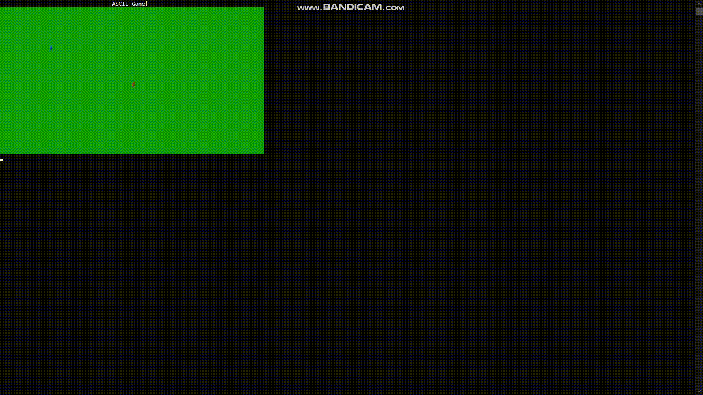

# ASCIIGame
ASCIIGame. But not just ASCII Game. It's example, how to create engine for your ASCII Game.
Last things added: Added sounds, added human with talking with him feature (new object, collision detection, cut scenes), wrote some helpful bat-files, made code better.

